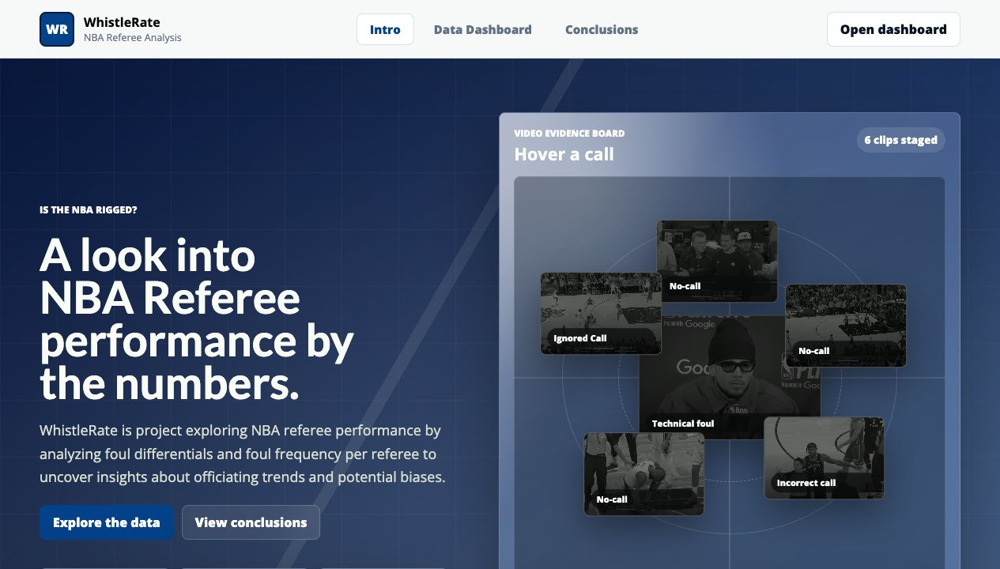
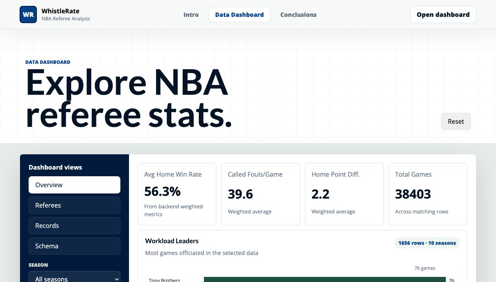
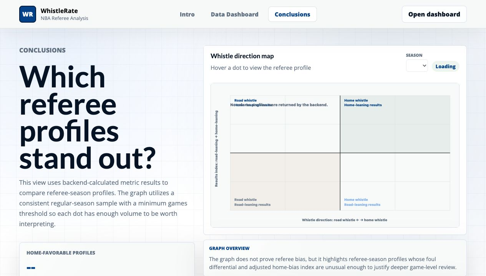

# NBA Ref Analytics

[](http://98.81.239.149)
[](https://github.com/alexyao2/nba-ref-analytics/actions/workflows/backend-tests.yml)

**[View the live demo →](http://98.81.239.149)**

NBA Ref Analytics ("WhistleRate") is a full-stack data application for exploring NBA referee trends across seasons. It examines foul differential, home-team indicators, referee consistency, and statistical outliers using publicly available referee statistics.

| Intro and film-review context | Interactive data dashboard |
| --- | --- |
|  |  |

| Referee-profile conclusions |
| --- |
|  |

## About the Website

- A **React + Vite** single-page interface with an evidence-board introduction, filterable dashboard, charts, referee records, and an interactive conclusion view.
- A **FastAPI** backend that owns CSV parsing, filtering, aggregation, and metric calculation—keeping the frontend focused on presentation.
- A reproducible **Docker Compose** environment with separate frontend and backend services, plus **Nginx** routing API requests under `/api`.
- Backend unit tests for referee filtering and analytical metric services, run in GitHub Actions before deployment.
- A small data pipeline that converts the stored NBA referee-statistics CSV into API responses for overview metrics, foul-differential leaders, outlier analysis, consistency analysis, and a home-bias index.

## Features

- Browse referee statistics across 2016–26 seasons
- Filter by season, split, minimum games officiated, and referee name
- Compare foul differential between home and road teams
- Calculate a home-bias index using weighted indicators
- Identify statistical outliers with z-scores
- Compare referee consistency across seasons
- Review selected controversial-call clips alongside aggregate results

## Architecture

```text
React / Vite frontend
        │  fetch /api/*
        ▼
Nginx reverse proxy ───► FastAPI backend ───► CSV data + analytics services
                              │
                              └── tests for filters and metrics
```

## Project structure

```text
nba-ref-analytics/
├── frontend/          # React/Vite UI and visual assets
├── backend/           # FastAPI routes, services, and tests
├── data/raw/          # Source CSV used by the backend
├── nginx/             # Reverse-proxy configuration
└── docker-compose.yml # Local multi-service setup
```

## Run locally

### Docker (recommended)

```bash
git clone https://github.com/alexyao2/nba-ref-analytics.git
cd nba-ref-analytics
docker compose up --build
```

Open [http://localhost/](http://localhost/) after the containers start. Nginx routes backend endpoints under `/api`; the health check is available at [http://localhost/api/health](http://localhost/api/health).

### Run services separately

```bash
# Terminal 1: backend
cd backend
python3 -m venv .venv
source .venv/bin/activate
pip install -r requirements.txt
uvicorn main:app --reload --port 8000
```

```bash
# Terminal 2: frontend
cd frontend
npm install
npm run dev
```

The Vite frontend runs at `http://localhost:3000`; FastAPI docs are available at `http://127.0.0.1:8000/docs`.

## API endpoints

```text
GET /api/health
GET /api/referees
GET /api/seasons
GET /api/splits
GET /api/metrics/overview
GET /api/metrics/foul-differential
GET /api/metrics/foul-differential/leaders
GET /api/metrics/home-bias
GET /api/metrics/conclusions/scatter
GET /api/metrics/outliers
GET /api/metrics/consistency
```

## Data and media attribution

### Referee statistics

The referee-statistics CSV is aggregated from [NBAstuffer](https://www.nbastuffer.com/). NBA Ref Analytics stores a project-specific copy for reproducibility and derives its own metrics from it. NBAstuffer, the NBA, and their respective data providers are not affiliated with or responsible for this project. Use of the source data remains subject to the source provider's terms and any applicable rights.

### Video sources

The selected clips are included solely to provide public-media context for the statistical discussion. Each clip remains the property of its original copyright holder and publisher. Sources:

- [WhistleRate logo video](https://www.youtube.com/watch?v=XprPDXWR1Js)
- [Brunson no-call, 2025–26](https://www.youtube.com/watch?v=CQ0mETrhYmI)
- [Booker playoff technical, 2025–26](https://www.youtube.com/watch?v=vCwhwUSsbMM)
- [Horford call review, 2025-26](https://www.youtube.com/watch?v=LJqZf7H5M6s)
- [Brown no-call, 2025-26](https://youtu.be/EV1KC_ipRuM?si=iQVS2fCIvoymq9LG)
- [LeBron no-call, 2022-23](https://youtu.be/nLsUFOlsRlU?si=M7OSU7eYf5LOghax)
- [SGA no-call, 2025-26](https://youtu.be/k93xvbm-NVk?si=6TII2Cf_L7C0dvVK)

This repository does not claim ownership of third-party NBA footage, broadcasts, or YouTube uploads. If you are a rights holder and would like material removed, please open an issue or contact the repository owner.

## License

Unless noted otherwise, the original source code in this repository is available under the [MIT License](LICENSE). Third-party data and media are excluded from that license and remain subject to their respective owners' terms and rights.
